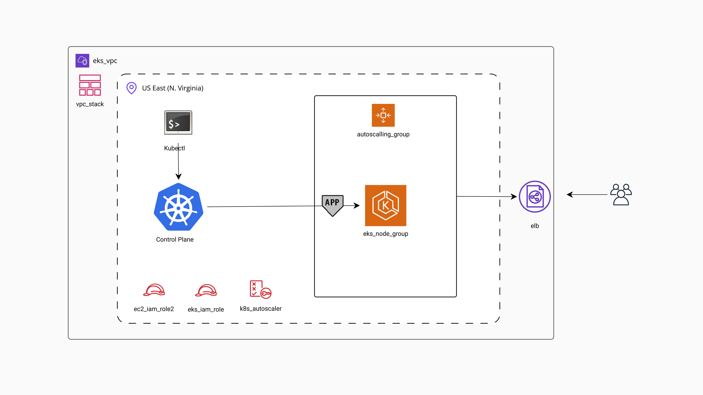

<h2 align="center"><u>EKS Autoscaler Nodegroup</u></h2>

<h4 align="center"> EKS Autoscaler Nodegroup </h4>

 

### [+] Description
This project demonstrates setting up an EKS cluster with autoscaling capabilities for worker nodes using Kubernetes Autoscaler and AWS Autoscaling. 

#### Steps to Create EKS Cluster:
---
**Create EKS Cluster IAM Role ->**
+ name: eks-cluster-role

**Create a VPC for Worker Nodes ->**
+ Use CloudFormation: `amazon-eks-vpc-private-subnets.yaml`

**Create EKS Cluster Master Nodes ->**
+ Cluster service role: `eks_iam_role`
+ Name: `cluster_name`
+ Cluster access: `Administrator access`
+ Access mode: `EKS API and ConfigMap`
+ VPC configuration: `eks_vpc_stack`
+ Security group configuration: `eks_vpc_stack`
+ Cluster endpoint access: `Public and private`

**Connect kubectl with EKS Cluster ->**
+ Create kubeconfig file.
+ Run: `aws configure list`
+ Update kubeconfig: `aws eks update-kubeconfig --name <CLUSTER_NAME>`
+ Verify: `kubectl cluster-info`

**Nodegroup IAM Role ->**
+ Name: `eks_nodegroup_role`
+ Attach policies:` AmazonEC2ContainerRegistryReadOnly`, `AmazonEKS_CNI_Policy`, `AmazonEKSWorkerNodePolicy`.

**Nodegroup Configuration: ->**
+ Name: `eks_nodegroup`
+ Role: `eks_nodegroup_role`
+ Instance specs: `t3.medium`
+ Scaling: `Desired 2`, `Min 2`, `Max 3`
+ Enable SSH access.

#### Steps to Create EKS Cluster:
---
+ Auto Scaling Group: Configure an auto-scaling group for nodes.
+ IAM Policy for Autoscaling:
  - Create a custom IAM policy: `nodegroup-autoscaler-policy.json`
+ Attach Policy: Attach the policy to the existing IAM role `eks_nodegroup_role`.
+ Cluster Autoscaler:
   - Apply the autoscaler component:  `kubectl apply -f cluster-autoscaler-autodiscover.yaml`
   - Edit the deployment for additional configurations:
     - Annotations: `cluster-autoscaler.kubernetes.io/safe-to-evict: "false"`
    - Add flags: `--balance-similar-node-groups` and `--skip-nodes-with-system-pods=false`
    - Update image version to match Kubernetes version: Autoscaler Tags <https://github.com/kubernetes/autoscaler/tags>
---
#### Deployment Example:
+ Create the Deployment:
   - `kubectl apply -f deployment/nginx_deployment.yaml`
+ Create the Service:
   - `kubectl apply -f deployment/nginx_service.yaml`
+ Open loadbalancer url to see nginx landing page.
+ Increase replicaset to `20`.
+ Monitor logs to verify autoscaling: `kubectl logs <autoscalerpod> -n kube-system`

### [+] Find me on 

